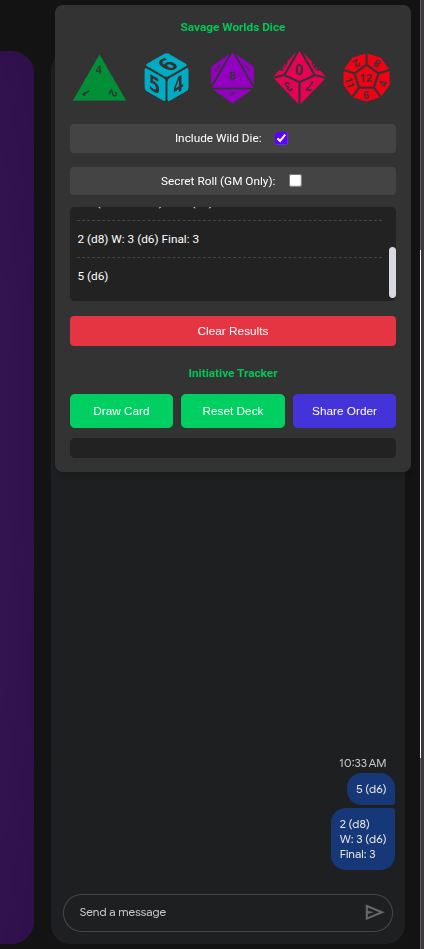
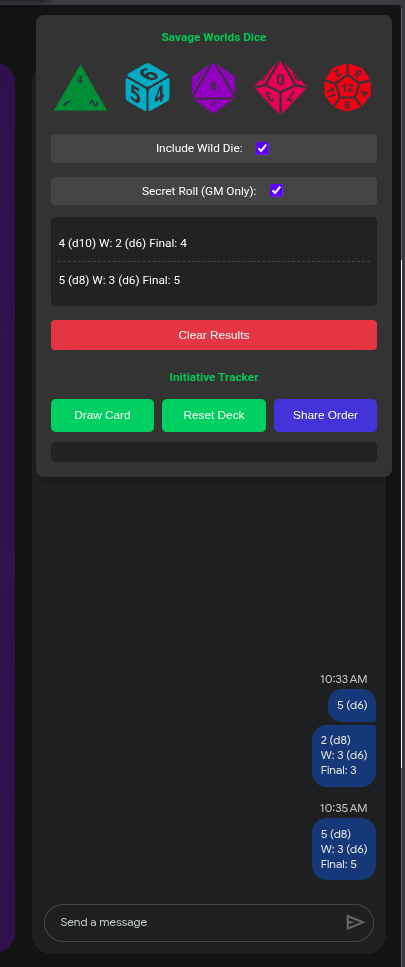
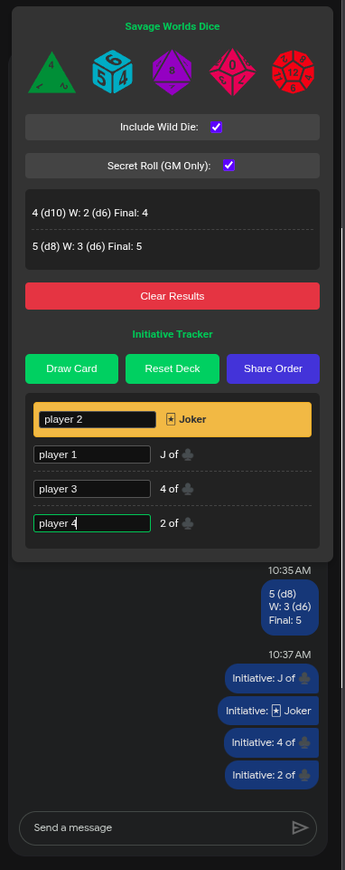
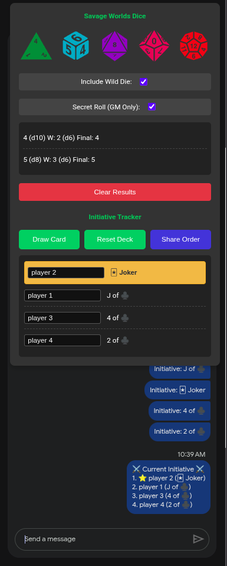

# Savage Worlds Dice Roller - Chrome Extension

*Leia este documento em [Português](./README_PT.md).*

[](https://codecov.io/gh/maiquelleonel/savage-dice-roller)


Uma extensão leve e poderosa para jogadores e mestres de **Savage Worlds RPG**. Projetada originalmente para o Google Meet, mas construída com uma arquitetura agnóstica que a torna compatível com quase qualquer chat web.

## 🚀 Funcionalidades

- **Mecânica Savage Worlds Real:** Suporte a dados explosivos (Aces) e Wild Die (d6) opcional.
- **Iniciativa Automática:** Sorteio de cartas com ordenação oficial (Rank + Naipe: ♠️ > ♥️ > ♦️ > ♣️).
- **Universal Chat Integration:** Detecta automaticamente campos de chat (`textarea:last-child`) e envia os resultados sem necessidade de copiar e colar.
- **Modo Mestre (Secret Roll):** Realize rolagens privadas que aparecem apenas na sua interface, sem notificar o chat.
- **Relatório de Iniciativa:** Gere um relatório formatado da ordem de turno para todos os jogadores com um clique.

## 📸 Capturas de Tela

| UI de Dados | Rastreador de Iniciativa |
| :---: | :---: |
|  |  |

| Integração de Chat | Configurações do Mestre |
| :---: | :---: |
|  |  |

## 🤝 Contribuição

Contribuições são super bem-vindas! Se você tem uma ideia de melhoria ou encontrou um bug, confira nosso [Guia de Contribuição](./CONTRIBUTING.md).

## 🛠️ Arquitetura e Tecnologias

Este projeto foi construído seguindo princípios de **Principal Engineering**, focando em resiliência e baixo acoplamento:

- **Bun:** Utilizado como Bundler ultrarrápido e Test Runner.
- **Híbrido Extension/ESM:** Lógica de negócio isolada em `src/core.js` para testabilidade total via módulos ES.
- **Injeção Dinâmica:** Background script que injeta recursos sob demanda, otimizando a performance do navegador.
- **Quality Gate:** Implementação de Git Hooks para garantir que nenhum código quebre os testes unitários antes de um commit.

## 📦 Como Instalar (Desenvolvimento)

1. Certifique-se de ter o [Bun](https://bun.sh) instalado.
2. Clone o repositório.
3. Instale as dependências:
   ```bash
   bun install
   ```
4. Gere o build:
   ```bash
   bun run build
   ```
5. No Chrome, vá em `chrome://extensions/`.
6. Ative o "Modo do desenvolvedor".
7. Clique em "Carregar sem compactação" e selecione a pasta raiz deste projeto.

## 🧪 Testes

A integridade das regras de Savage Worlds é garantida por uma suíte de testes robusta:

```bash
bun test
```

## 🗺️ Roadmap (Futuro)

- [ ] **Dashboard do Mestre:** Uma área dedicada em aba separada para gestão de cenas.
- [ ] **Gestão de Extras:** Controle de NPCs e lacaios diretamente pela extensão.
- [ ] **Ficha do Personagem:** Interface para jogadores preencherem atributos e derivarem rolagens automaticamente.
- [ ] **Sincronização de Estado:** Persistência de dados entre sessões usando `chrome.storage`.

## 🎨 Créditos e Licença

- **Dados (SVGs):** Os ícones de dados foram criados por **Skoll** e **Delapouite**, disponíveis em [Game-icons.net](https://game-icons.net/), sob a licença **CC BY 3.0**.
- **Software:** Este projeto está sob a licença [MIT](./LICENSE).

---
Desenvolvido com ☕ e 🎲 por [Maiquel Leonel](https://maiquelleonel.com.br).
